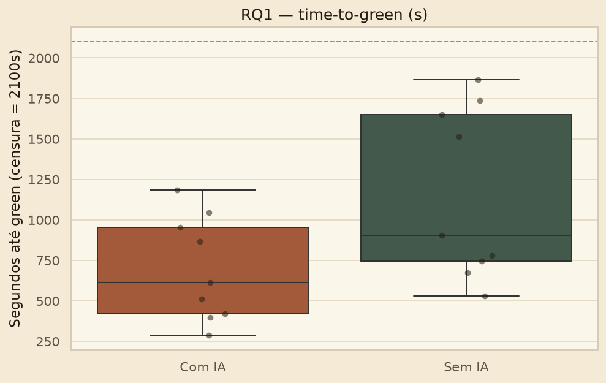
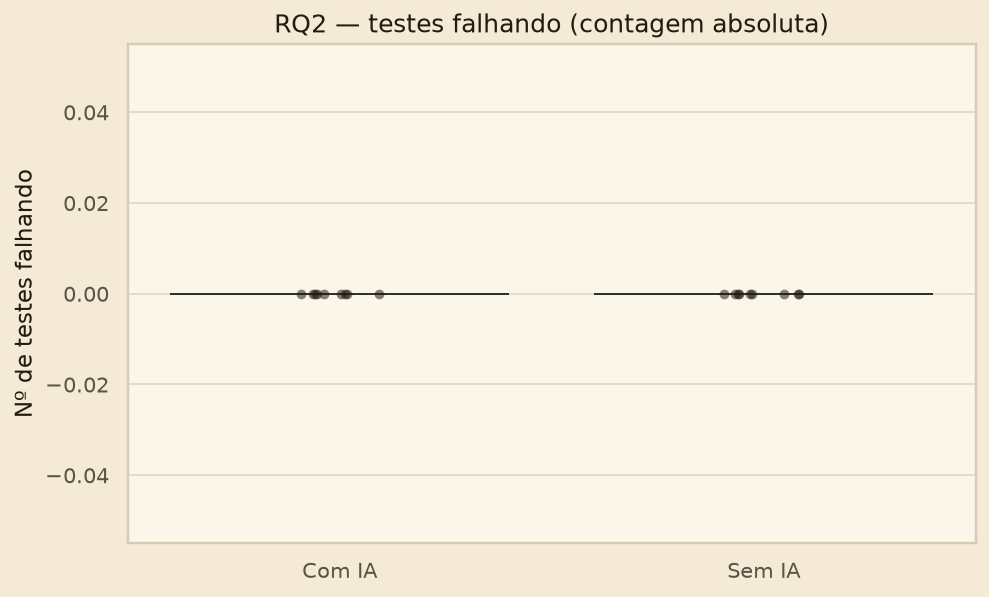

# Análise S03 — Gabriel Rodrigues (P1)

**Parte:** Wilcoxon signed-rank para RQ1 (tempo) e RQ2 (defeitos)  
**Fonte:** os 18 trials da Entrega 2 (`metrics_results/trials_master.csv`) — mesmos testes JUnit e mesmos tempos do lab oficial.  
**Teste:** Wilcoxon exact, α = 0,05. Descritivo: **mediana e IQR** (nunca média).  
**Script:** `experimento/analise/s03_p1_wilcoxon.py`

Este arquivo é a entrega individual do P1. Não é um site: gráfico e texto ficam neste Markdown.

## Trials deste integrante

| # | Kata | Título | Tratamento | Tempo (s) | Testes | Status | WMC | LOC | CPD |
| --- | --- | --- | --- | --- | --- | --- | --- | --- | --- |
| 1 | kata1 | Roman Numerals Converter | Com IA | 512 | 2/2 | COMPLETED | 5.0 | 18.0 | 0 |
| 2 | kata2 | Bowling Game Score | Sem IA | 1648 | 3/3 | COMPLETED | 7.0 | 29.0 | 24 |
| 3 | kata3 | Custom FizzBuzz Builder | Com IA | 287 | 1/1 | COMPLETED | 9.0 | 19.0 | 0 |
| 4 | kata4 | String Calculator | Sem IA | 1512 | 5/5 | COMPLETED | 9.0 | 37.0 | 10 |
| 5 | kata5 | Poker Hand Evaluator | Com IA | 1044 | 2/2 | COMPLETED | 29.0 | 59.0 | 0 |
| 6 | kata6 | Luhn Algorithm Validator | Sem IA | 903 | 2/2 | COMPLETED | 11.0 | 35.0 | 0 |

Mediana Com IA (meus 3 trials): **512s**.  
Mediana Sem IA (meus 3 trials): **1512s**.  
Delta (IA − manual): **-1000s**.

## RQ1 — time-to-green

$H_{0,1}$: mediana(IA) = mediana(manual).  
$H_{1,1}$: mediana(IA) < mediana(manual).

Métrica: segundos até `mvn test` verde. Time-box 35 min; incompleto = censurado em 2100s (neste dataset, 0 censurados). Nenhum trial foi descartado.

### Descritivo (9 trials por tratamento)

| Tratamento | n | Mediana (s) | Q1 | Q3 | IQR |
| --- | --- | --- | --- | --- | --- |
| Com IA | 9 | 614.0 | 421.0 | 955.0 | 534.0 |
| Sem IA | 9 | 903.0 | 746.0 | 1648.0 | 902.0 |

### Pareado por participante (teste primário, n=3)

| ID | Participante | Mediana Com IA (s) | Mediana Sem IA (s) | Δ (IA − manual) |
| --- | --- | --- | --- | --- |
| P1 | Gabriel Rodrigues | 512.0 | 1512.0 | -1000.0 |
| P2 | Leonardo | 614.0 | 746.0 | -132.0 |
| P3 | Pedro Henrique | 955.0 | 781.0 | 174.0 |

Wilcoxon (alternativa *less*): n=3, W=2.0, p=0.375, alternativa=less → não rejeita H0 (α=0.05).

### Pareado por kata (exploratório, n=6)

Isola a dificuldade do exercício. Não substitui o teste primário — com n=3 o teste nunca rejeitaria H0 sozinho (p mínimo unilateral = 0,125).

| Kata | Título | Mediana Com IA (s) | Mediana Sem IA (s) | Δ |
| --- | --- | --- | --- | --- |
| kata1 | Roman Numerals Converter | 466.5 | 746.0 | -279.5 |
| kata2 | Bowling Game Score | 911.5 | 1648.0 | -736.5 |
| kata3 | Custom FizzBuzz Builder | 287.0 | 601.5 | -314.5 |
| kata4 | String Calculator | 614.0 | 1625.0 | -1011.0 |
| kata5 | Poker Hand Evaluator | 1115.0 | 1864.0 | -749.0 |
| kata6 | Luhn Algorithm Validator | 398.0 | 842.0 | -444.0 |

Wilcoxon (alternativa *less*): n=6, W=0.0, p=0.0156, alternativa=less → rejeita H0 (α=0.05).

### Gráficos

**Leitura.** Descritivamente a IA é mais rápida (614s vs 903s). O teste primário não rejeita $H_{0,1}$ (p=0,375): Pedro Henrique foi mais lento *com* IA porque nesse braço caíram Bowling e Poker. O pareamento por kata, que controla essa dificuldade, rejeita $H_{0,1}$ (p=0,0156) — os 6 exercícios foram mais rápidos com IA.

**Resposta RQ1:** a IA reduz o tempo no descritivo e no teste por kata. O within-subject com n=3 não tem poder.

## RQ2 — defeitos / taxa de sucesso

$H_{0,2}$: taxa de sucesso IA = manual.  
$H_{1,2}$: taxa IA > taxa manual.

### Descritivo

- Sucesso Com IA: mediana 100.0% (IQR 0.0)
- Sucesso Sem IA: mediana 100.0% (IQR 0.0)
- Testes falhando: mediana 0 nos dois tratamentos (efeito teto)

| ID | Participante | % sucesso IA | % sucesso manual | Δ |
| --- | --- | --- | --- | --- |
| P1 | Gabriel Rodrigues | 100.0 | 100.0 | 0.0 |
| P2 | Leonardo | 100.0 | 100.0 | 0.0 |
| P3 | Pedro Henrique | 100.0 | 100.0 | 0.0 |

Wilcoxon (sucesso, alternativa *greater*): n=3, W=—, p=1.0, alternativa=greater → não rejeita H0 (α=0.05). Todas as diferenças pareadas são zero — H0 não rejeitada.

### Gráficos

**Resposta RQ2:** não rejeita $H_{0,2}$. Os testes de aceitação são poucos e todos os 18 trials fecharam 100% dentro do time-box. A métrica não discrimina.

## Conclusão desta parte

| RQ | Achado | Decisão (α=0,05) |
| --- | --- | --- |
| RQ1 primário (participante) | 614s vs 903s; p=0,375 | não rejeita $H_{0,1}$ |
| RQ1 exploratório (kata) | 6/6 katas mais rápidos com IA; p=0,0156 | rejeita $H_{0,1}$ |
| RQ2 | 100% vs 100%; p=1,0 | não rejeita $H_{0,2}$ |
