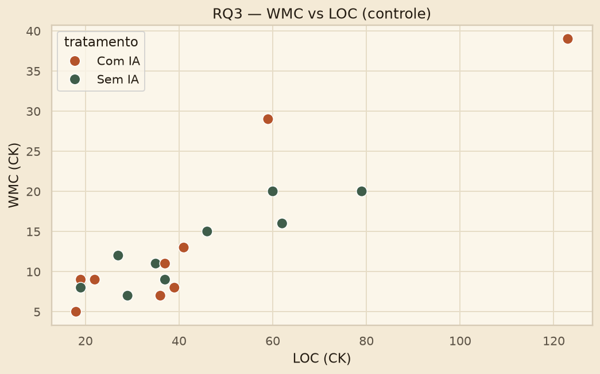

# Análise S03 — Leonardo (P2)

**Parte:** RQ3 — estrutura do código (WMC, duplicação CPD, LOC de controle)  
**Fonte:** os 18 trials da Entrega 2 (`metrics_results/trials_master.csv`) — mesmos testes JUnit e mesmas métricas CK/PMD do lab oficial.  
**Teste:** Wilcoxon exact two-sided, α = 0,05. Descritivo: **mediana e IQR**.  
**Script:** `experimento/analise/s03_p2_rq3.py`

Este arquivo é a entrega individual do P2. Gráficos e texto ficam neste Markdown (não há site).

## Hipóteses

- $H_{0,3a}$: WMC IA = WMC manual. $H_{1,3a}$: WMC difere.
- $H_{0,3b}$: duplicação IA = duplicação manual. $H_{1,3b}$: duplicação difere.

LOC entra como **controle**: um WMC maior pode ser só verbosidade da IA. Por isso reportamos WMC, LOC e WMC/LOC juntos. CK 0.7.0 e PMD 7.15 CPD (`--minimum-tokens 10`).

## Trials deste integrante

| # | Kata | Título | Tratamento | Tempo (s) | Testes | Status | WMC | LOC | CPD |
| --- | --- | --- | --- | --- | --- | --- | --- | --- | --- |
| 1 | kata1 | Roman Numerals Converter | Sem IA | 746 | 2/2 | COMPLETED | 16.0 | 62.0 | 0 |
| 2 | kata2 | Bowling Game Score | Com IA | 868 | 3/3 | COMPLETED | 13.0 | 41.0 | 23 |
| 3 | kata3 | Custom FizzBuzz Builder | Sem IA | 531 | 1/1 | COMPLETED | 8.0 | 19.0 | 0 |
| 4 | kata4 | String Calculator | Com IA | 614 | 5/5 | COMPLETED | 11.0 | 37.0 | 0 |
| 5 | kata5 | Poker Hand Evaluator | Sem IA | 1864 | 2/2 | COMPLETED | 20.0 | 60.0 | 10 |
| 6 | kata6 | Luhn Algorithm Validator | Com IA | 398 | 2/2 | COMPLETED | 9.0 | 22.0 | 0 |

Mediana WMC Com IA (meus 3 trials): **11.0**.  
Mediana WMC Sem IA (meus 3 trials): **16.0**.  
Mediana LOC Com IA / Sem IA: **37.0** / **60.0**.

## Descritivo do grupo (mediana · IQR)

| Métrica | Com IA | Sem IA |
| --- | --- | --- |
| WMC | 9.0 (IQR 5.0) | 12.0 (IQR 7.0) |
| LOC (controle) | 37.0 (IQR 19.0) | 37.0 (IQR 31.0) |
| WMC/LOC | 0.3171 (IQR 0.1313) | 0.3143 (IQR 0.0802) |
| CPD tokens | 0.0 (IQR 12.0) | 10.0 (IQR 13.0) |

## Pares within-subject (mediana por participante)

### WMC

| ID | Participante | Com IA | Sem IA | Δ |
| --- | --- | --- | --- | --- |
| P1 | Gabriel Rodrigues | 9.0 | 9.0 | 0.0 |
| P2 | Leonardo | 11.0 | 16.0 | -5.0 |
| P3 | Pedro Henrique | 8.0 | 15.0 | -7.0 |

### LOC (controle)

| ID | Participante | Com IA | Sem IA | Δ |
| --- | --- | --- | --- | --- |
| P1 | Gabriel Rodrigues | 19.0 | 35.0 | -16.0 |
| P2 | Leonardo | 37.0 | 60.0 | -23.0 |
| P3 | Pedro Henrique | 39.0 | 46.0 | -7.0 |

### WMC/LOC

| ID | Participante | Com IA | Sem IA | Δ |
| --- | --- | --- | --- | --- |
| P1 | Gabriel Rodrigues | 0.4737 | 0.2432 | 0.2304 |
| P2 | Leonardo | 0.3171 | 0.3333 | -0.0163 |
| P3 | Pedro Henrique | 0.2051 | 0.3261 | -0.121 |

### CPD (tokens)

| ID | Participante | Com IA | Sem IA | Δ |
| --- | --- | --- | --- | --- |
| P1 | Gabriel Rodrigues | 0.0 | 10.0 | -10.0 |
| P2 | Leonardo | 0.0 | 0.0 | 0.0 |
| P3 | Pedro Henrique | 12.0 | 13.0 | -1.0 |

## Inferência (Wilcoxon two-sided)

| Comparação | Resultado |
| --- | --- |
| WMC, participante | n=3, W=0.0, p=0.5, alternativa=two-sided → não rejeita H0 (α=0.05). |
| WMC/LOC, participante | n=3, W=3.0, p=1.0, alternativa=two-sided → não rejeita H0 (α=0.05). |
| CPD, participante | n=3, W=0.0, p=0.5, alternativa=two-sided → não rejeita H0 (α=0.05). |
| LOC, participante | n=3, W=0.0, p=0.25, alternativa=two-sided → não rejeita H0 (α=0.05). |
| WMC, kata | n=6, W=8.0, p=0.6875, alternativa=two-sided → não rejeita H0 (α=0.05). |
| CPD, kata | n=6, W=3.0, p=0.625, alternativa=two-sided → não rejeita H0 (α=0.05). |

## Gráficos

**Leitura.** A mediana de LOC é a mesma nos dois tratamentos (37). WMC bruto é um pouco menor com IA (9 vs 12), mas WMC/LOC fica praticamente igual (0,317 vs 0,314). CPD tem mediana 0 com IA e 10 sem IA; o teste pareado não rejeita igualdade (p=0,50). Sem o controle de LOC, um WMC maior poderia ser só verbosidade — aqui isso não aparece.

**Resposta RQ3:** não há evidência de que a IA altere complexidade ciclomática ou duplicação depois de controlar por LOC. Não rejeitamos $H_{0,3a}$ nem $H_{0,3b}$.
