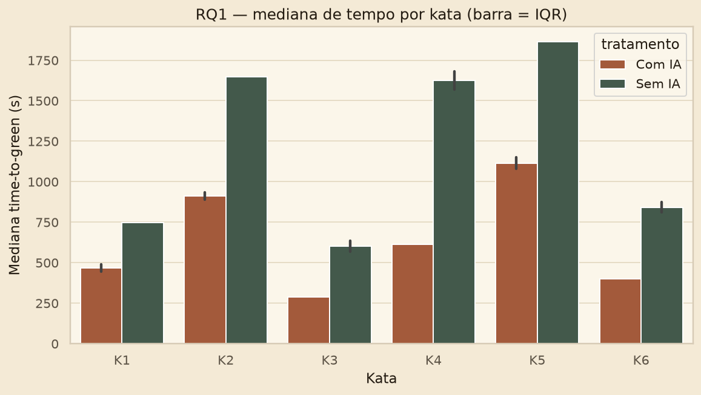
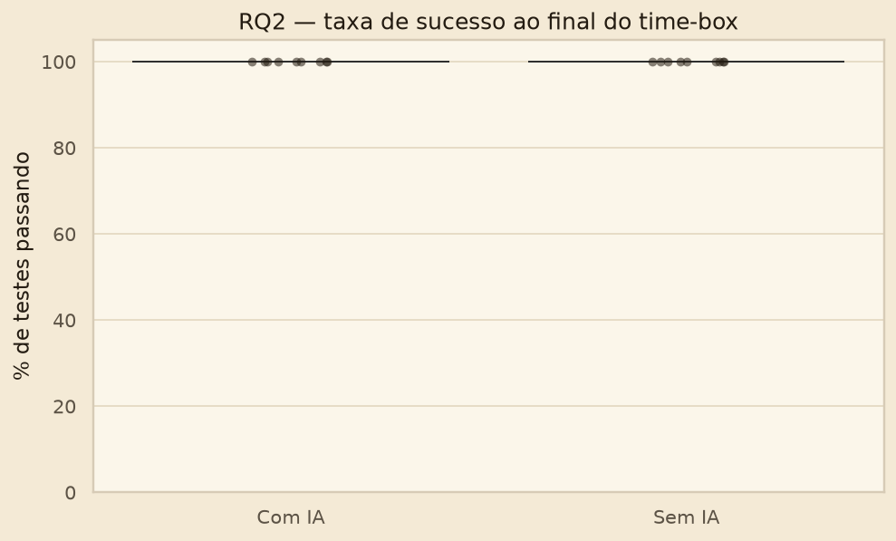
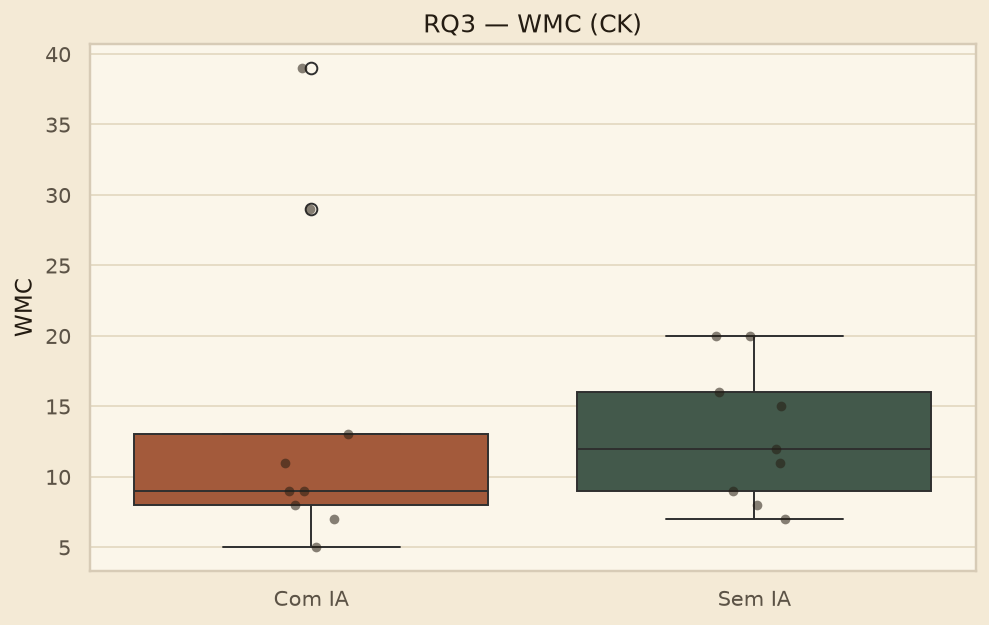
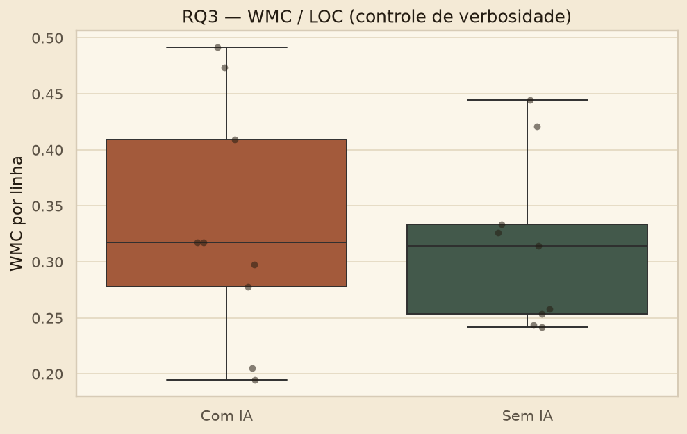
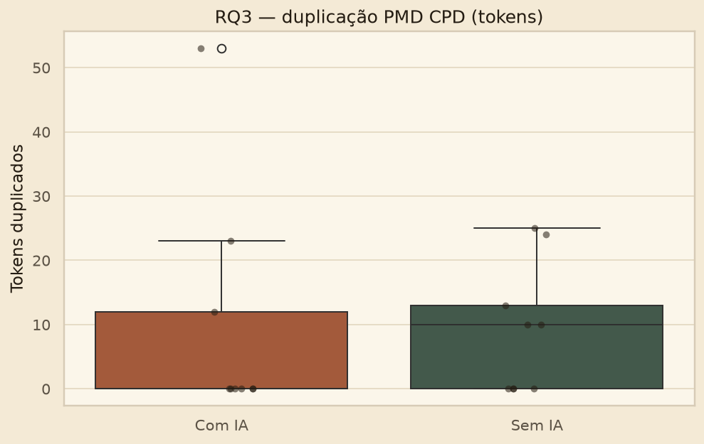

# Análise S03 — Pedro Henrique (P3)
**Parte:** dashboard Pandas + Seaborn (Passo 6 do enunciado)  

Oito figuras geradas com mediana/IQR (nunca média como estatística principal). Cada gráfico entra neste Markdown.

## Trials deste integrante

| # | Kata | Título | Tratamento | Tempo (s) | Testes | Status | WMC | LOC | CPD |
| --- | --- | --- | --- | --- | --- | --- | --- | --- | --- |
| 1 | kata1 | Roman Numerals Converter | Com IA | 421 | 2/2 | COMPLETED | 8.0 | 39.0 | 0 |
| 2 | kata2 | Bowling Game Score | Com IA | 955 | 3/3 | COMPLETED | 7.0 | 36.0 | 12 |
| 3 | kata3 | Custom FizzBuzz Builder | Sem IA | 672 | 1/1 | COMPLETED | 12.0 | 27.0 | 13 |
| 4 | kata4 | String Calculator | Sem IA | 1738 | 5/5 | COMPLETED | 20.0 | 79.0 | 25 |
| 5 | kata5 | Poker Hand Evaluator | Com IA | 1186 | 2/2 | COMPLETED | 39.0 | 123.0 | 53 |
| 6 | kata6 | Luhn Algorithm Validator | Sem IA | 781 | 2/2 | COMPLETED | 15.0 | 46.0 | 0 |

Neste braço caíram Bowling e Poker **com IA**. A mediana de tempo Com IA (955s) ficou acima da mediana Sem IA (781s) - o oposto de Gabriel e Leonardo. Isso explica o teste primário de RQ1 não rejeitar $H_0$ mesmo com o grupo mais rápido com IA no descritivo.

## RQ1 — tempo

A linha tracejada em 2100s é o time-box. Nenhum ponto chega lá: 0 trials censurados. A caixa Com IA é mais baixa e mais estreita (mediana 614s, IQR 534) do que Sem IA (mediana 903s, IQR 902).

Nas 6 katas a barra Com IA fica abaixo da Sem IA. Poker e Bowling puxam o tempo para cima nos dois tratamentos; FizzBuzz é o mais curto. A barra de erro é o IQR (percentil 25–75), não o desvio-padrão.

## RQ2 — defeitos

Efeito teto: 18/18 trials em 100% de testes passando. Os pontos coincidem no topo. A suíte oficial é curta (1 a 5 testes por kata) e coube no time-box.

## RQ3 — estrutura

O scatter WMC×LOC mostra que complexidade sobe com tamanho nos dois tratamentos. O ponto mais alto à direita é o Poker Com IA deste integrante (WMC 39, LOC 123, 53 tokens CPD) — outlier de verbosidade, não um padrão do tratamento. Depois de dividir por LOC, as caixas Com IA e Sem IA se sobrepõem.